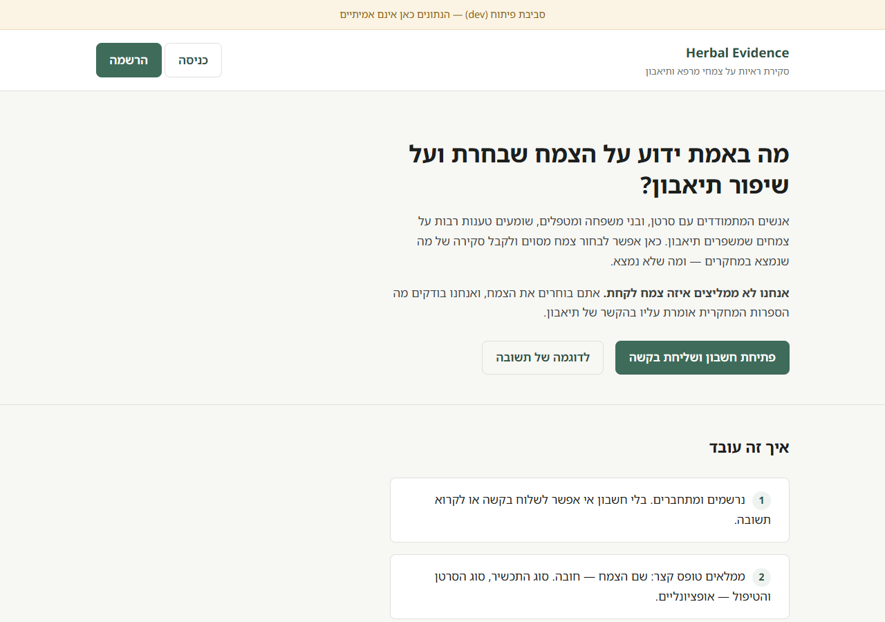
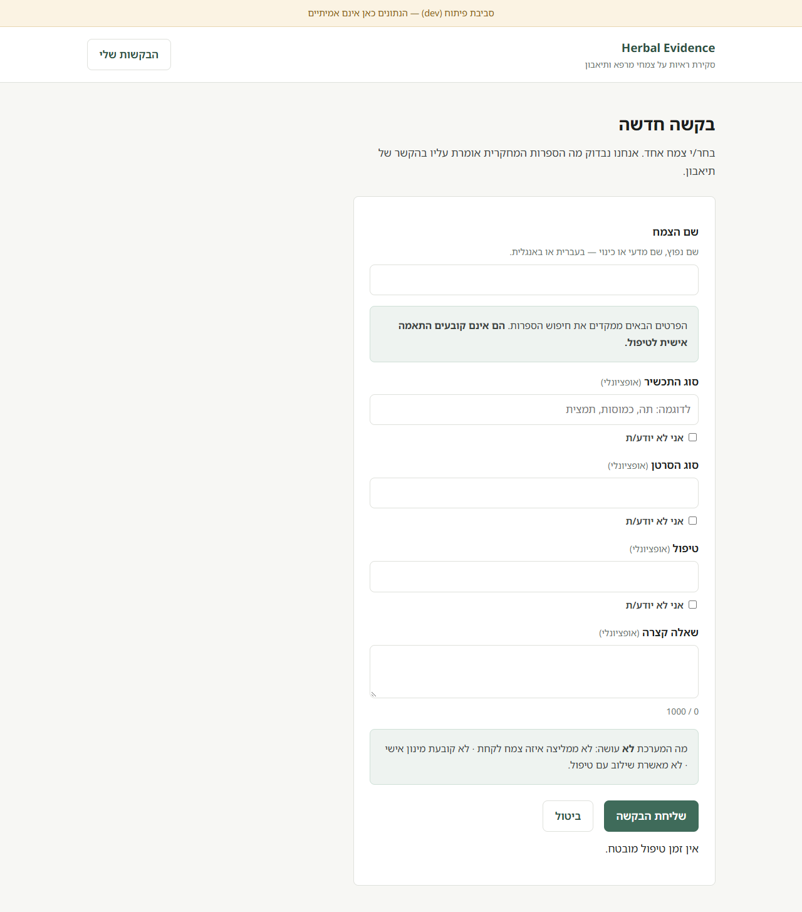
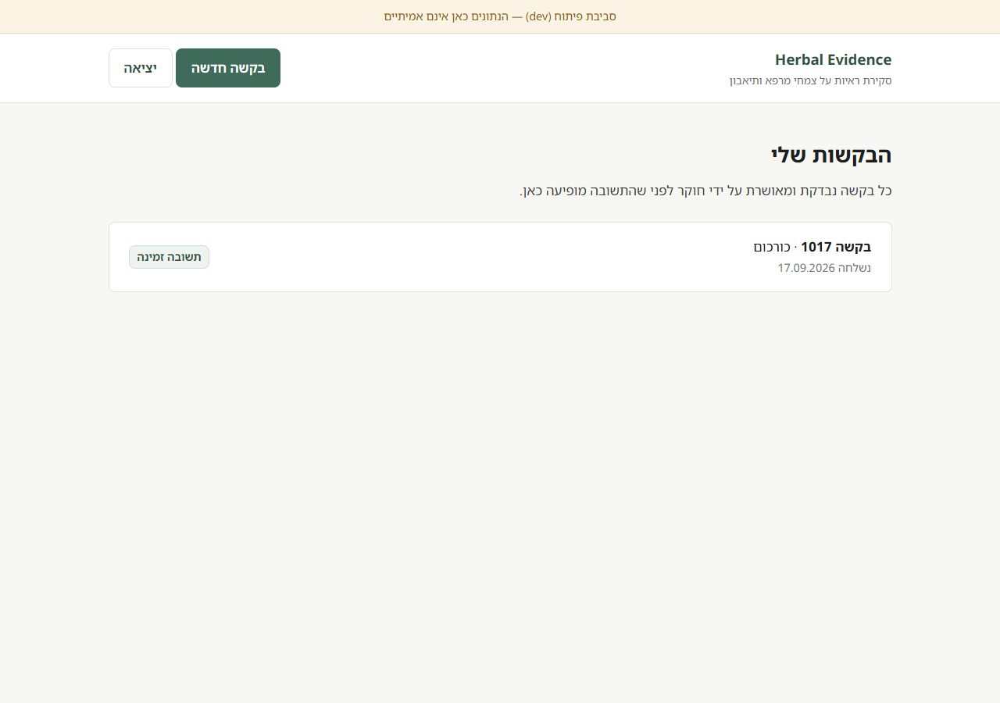
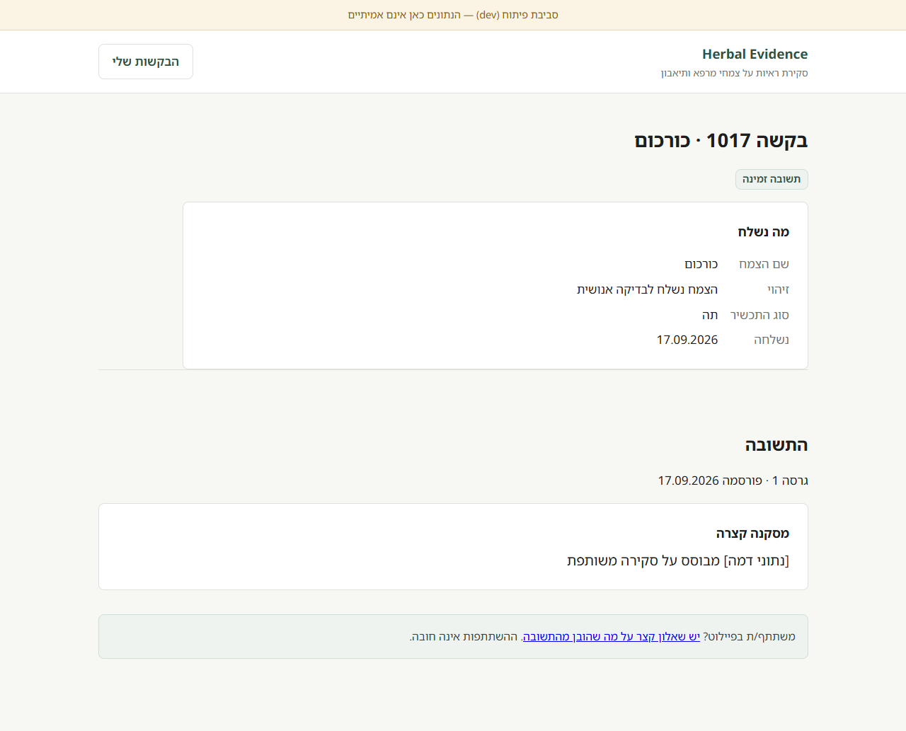
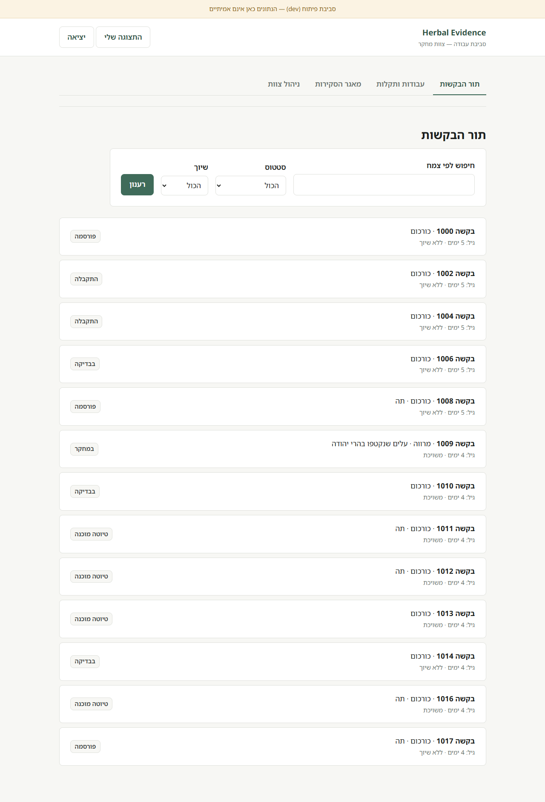
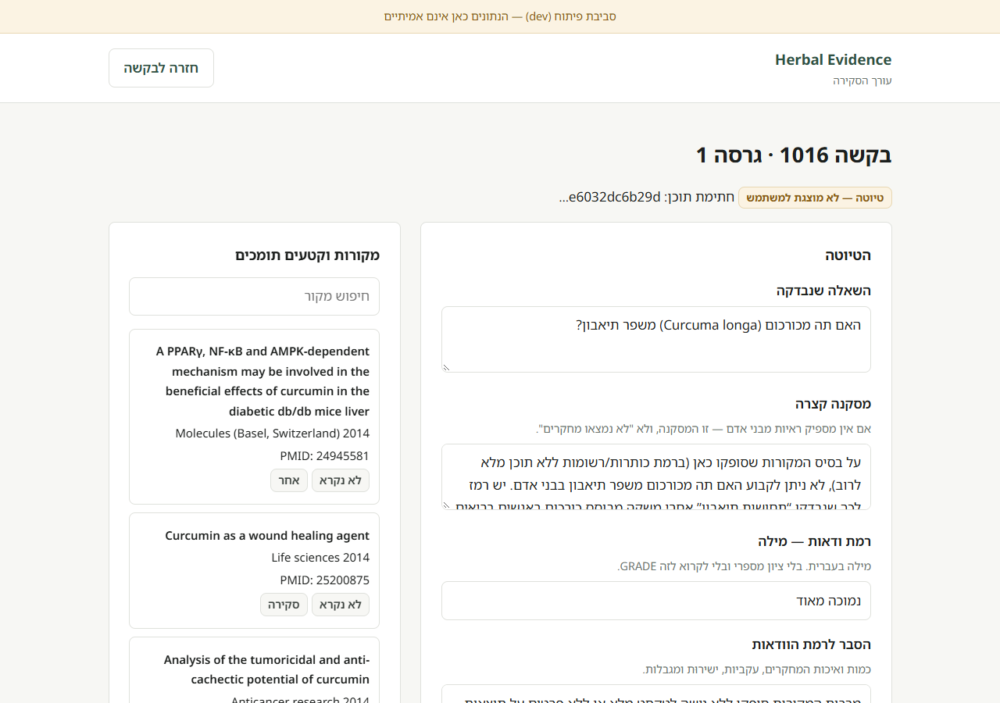
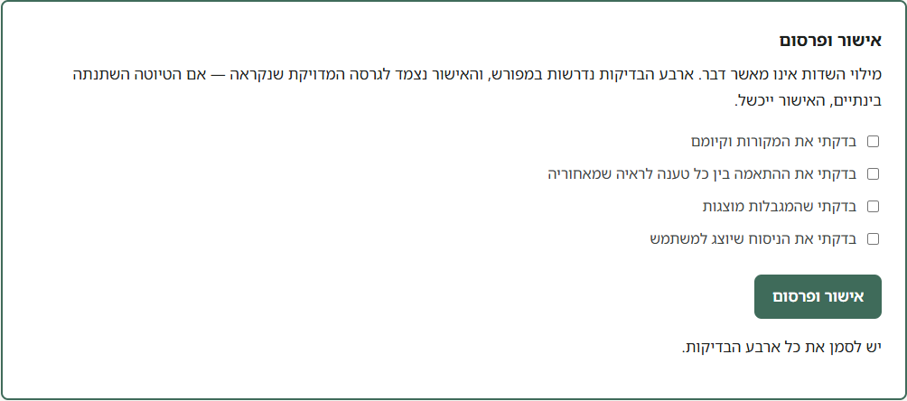
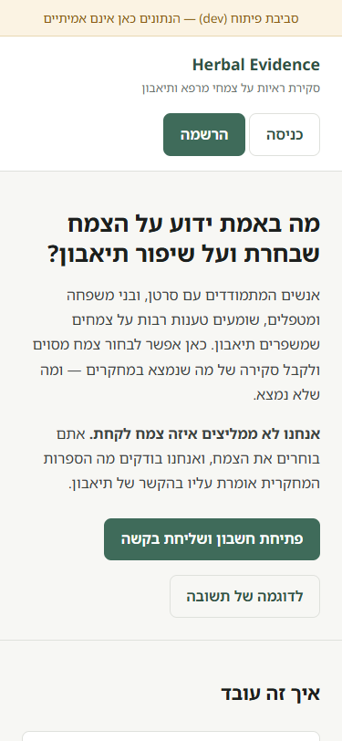
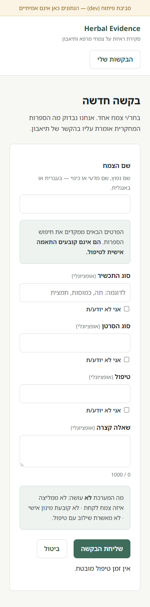

# Herbal Evidence (ראיות צמחים)

Hebrew-first (RTL) web platform where people with cancer and their caregivers submit a claim about a **single herb and appetite improvement**. The system prepares an AI-assisted evidence-review draft; a **human researcher checks, edits, and approves** every personalized response before it is published to the user's account.

The platform does **not** recommend which herb to take, does not prescribe doses, and does not approve combinations with treatment.

## What it looks like

All Hebrew, right-to-left. Captured from the running `dev` site - the banner in
each image says so, and every request in them is mock data.

### The claim, and what a person submits

| Landing | Submitting a request |
|---|---|
| [](docs/screenshots/01-landing.png) | [](docs/screenshots/03-new-request.png) |

The form asks for one herb. It does not ask for a medical profile, an ID
number or records - see `docs/privacy-and-retention.md`.

### Waiting, and reading an approved answer

| My requests | A published response |
|---|---|
| [](docs/screenshots/04-my-requests.png) | [](docs/screenshots/05-published-response.png) |

Status is always a word. Colour is a secondary cue and never carries the
message on its own. No turnaround time is promised anywhere.

### The researcher's side

| Queue | Review editor |
|---|---|
| [](docs/screenshots/06-researcher-queue.png) | [](docs/screenshots/07-review-and-approve.png) |

The draft sits beside the sources it was built from, each labelled from MeSH
headings rather than from its title. The badge reads **"draft - not shown to
the user"**, and the content hash under it is what an approval binds to.

### The guarantee, in one screen

[](docs/screenshots/07b-four-confirmations.png)

Four explicit confirmations, enforced by the API **and** by a check constraint
in the database, so an approval row cannot exist without all four. The approval
is bound to the exact draft that was read: if it changed in between, the
approval is refused rather than silently publishing something nobody checked.

**Nothing transitions into `published` except this button.** The AI cannot
approve and cannot publish.

### On a phone

| Landing | Submitting a request |
|---|---|
| [](docs/screenshots/08-mobile-landing.png) | [](docs/screenshots/09-mobile-new-request.png) |

375px wide, zero horizontal overflow.

Regenerate these with `backend/.venv/Scripts/python scripts/screenshots.py`.

## Monorepo layout

| Path | Purpose |
|------|---------|
| `frontend/` | Static HTML/CSS/JS site (own Railway service) |
| `backend/` | FastAPI + Uvicorn API, research/AI workflow, Postgres-backed job queue (own Railway service) |
| `supabase/` | Supabase CLI config, migrations, mock seed |
| `docs/` | Architecture, decisions, data model, deployment, researcher guide, privacy |
| `scripts/` | Remote auth configuration, and the screenshot generator |

## Environments

| Env | Git branch | Railway env | Supabase project |
|-----|-----------|-------------|------------------|
| dev | `dev` | `dev` | `herbal-evidence-dev` |
| production | `main` | `production` | `herbal-evidence-prod` |

Details and setup steps: see `docs/deployment.md`. Development status per phase is tracked in the project's Obsidian vault.

## Local development

No Docker and no `uv` on the current machine — see `docs/decisions.md` D-015 to D-017.

**Backend** (Python 3.12+):

```bash
cd backend
python -m venv .venv
.venv/Scripts/python -m pip install -e ".[dev]"
.venv/Scripts/python -m pytest -q
.venv/Scripts/python -m uvicorn app.main:app --reload --port 8000
```

`GET /health` returns liveness. `GET /ready` reports which configuration is present
("set" / "missing") and never a value.

**Frontend** (any static server):

```bash
cd frontend
python -m http.server 4173
```

`config.js` in the repo holds local defaults. In the container it is rewritten from
environment variables by `entrypoint.sh` — public values only.

**Supabase**: remote-only. `npx supabase db push --linked` against the `dev` project.
`supabase start` and `db diff` need Docker and are unavailable here.

## Status

All eight phases are built and deployed. Two environments are live and verified.

| | |
|---|---|
| Acceptance criteria | 12/12 - see `docs/acceptance.md` |
| Offline tests | 76 |
| Live suites | 24 + 12 + 22 + 14 + 7 checks against the dev project |
| Environments | `dev` and `production`, four service instances, branch wiring verified |

**Read `docs/limitations.md` before claiming anything about this platform.** In
particular: no automated test establishes scientific quality, full article text
is not read yet, and production is deployed but has never been used.

| Document | What is in it |
|---|---|
| `docs/architecture.md` | Where each product guarantee is actually enforced |
| `docs/data-model.md` | Tables, constraints that carry product rules, RLS |
| `docs/deployment.md` | Branches, environments, variables, migrations, rollback |
| `docs/researcher-guide.md` | For the person who is the last check before a patient reads |
| `docs/privacy-and-retention.md` | What is collected and what leaves the system. Not an approved policy |
| `docs/acceptance.md` | The twelve criteria and where each is verified |
| `docs/limitations.md` | Done, blocked, untested, and open decisions |
| `docs/decisions.md` | D-001 to D-068, including which ones supersede which |
